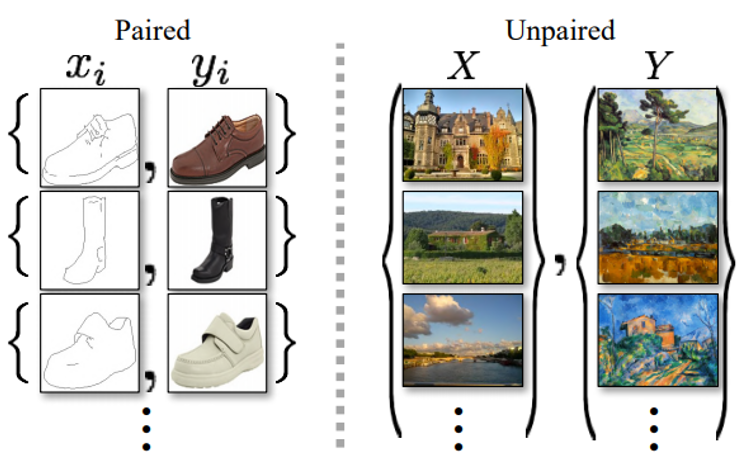
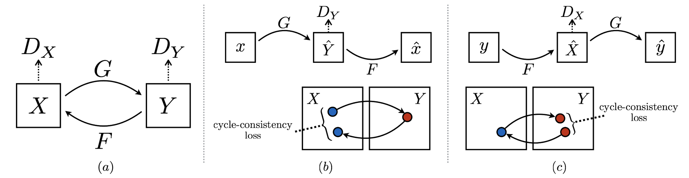
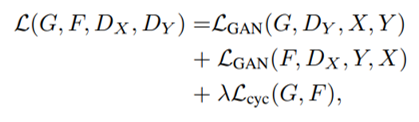
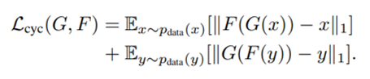
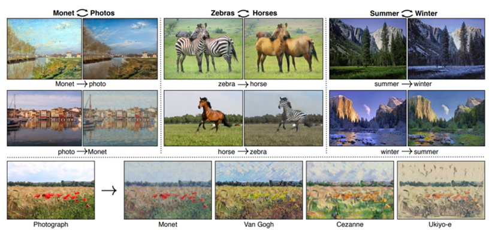
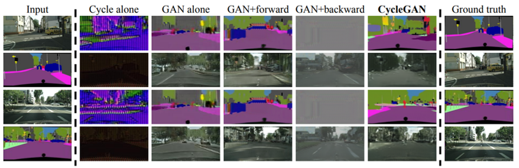
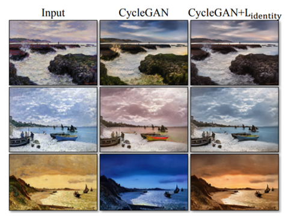
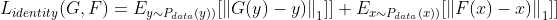
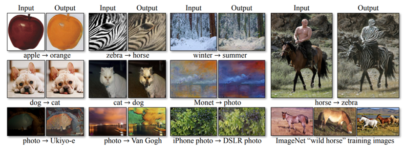

# CycleGAN

###  [*Unpaired Image-to-Image Translation using Cycle-Consistent Adversarial Networks*](https://arxiv.org/pdf/1703.10593.pdf)

* **Pix2Pix와 동일한 Style transfer지만 Unpaired 데이터와 순환 일관성 손실 함수를 사용함.**

* ### **Unpaired Data?**

  

  * Image Colorization, Edge를 Object로 만드는 등, Paired Dataset은 Data 수집이 어렵지 않음
  * 그러나 화가의 그림을 실제처럼 바꾸거나 하는 등의 dataset은 구성하기 어려움
  * 또한 Paired data는 이미지쌍에 공통된 특징(ex. 좌표값)이 존재하기 때문에 상대적으로 학습이 쉬운데 반해, Unpaired Data는 x-y간 유사성이 없기 때문에  Pix2Pix와 다른 학습 방법을 사용해야 함

 

* ### Training

  

  * G, F, Dx, Dy 총 4개 모델을 훈련

  * G는 X를 받아 Y^=G(X) 을 생성함. 이때 무작정 target distribution에 위치하도록 하는것 뿐만 아니라, F를 사용해서 복원했을 때 다시 돌아올 수 있을 정도만 변환함(순환 일관성)

  * X -> Y mapping을 forward consistency, Y -> X mapping을 backward consistency 라고 함

    

  * G만 사용할 목적으로 단방향만 학습을 진행하면 결과가 더 나빠졌다고 함

    

* ### Loss Function

  

  * G, F 모두 훈련을 위한 2개의 GAN Loss에 순환 일관성을 보존하기 위한 Cycle Loss가 추가됨

    

    

  * cycle loss는 2개의 L1 loss의 합으로 구성되며,  G를 거쳐 생성된 이미지를 F로 복원시킨 이미지와 원래 이미지의 L1 loss, 그리고 반대의 경우로 구성됨

  * 즉 F(G(X)) = X, G(F(Y)) = Y일 때 loss가 minimize이기 때문에, D를 속이는것뿐만 아니라 이미지의 복원도 함께 고려하여 학습함

  * GAN Loss에서 Cross Entropy 대신 least-square loss로 사용하는것이 더 안정적으로 좋은 결과를 뽑아냈다고 함

  

  

* ### Experiment

  

  

  

  

  

  * Identity Loss 유뮤에 따른 결과

    * Identity Loss :  

    * Painting -> Photo 변환작업시 색 변질이 많이 발생했는데, input과  output을 직접 비교하는 Identity Loss를 추가하였더니 색이 많이 보존됨. (Pixel loss랑 비슷한듯)

      

  

  * 다만 사과를 오렌지로 바꿔도 **전체적인 모양**은 바뀌지 않았고, 개-고양이 변환이나 기타 몇몇 Task에서 한계점이 나타남. 

